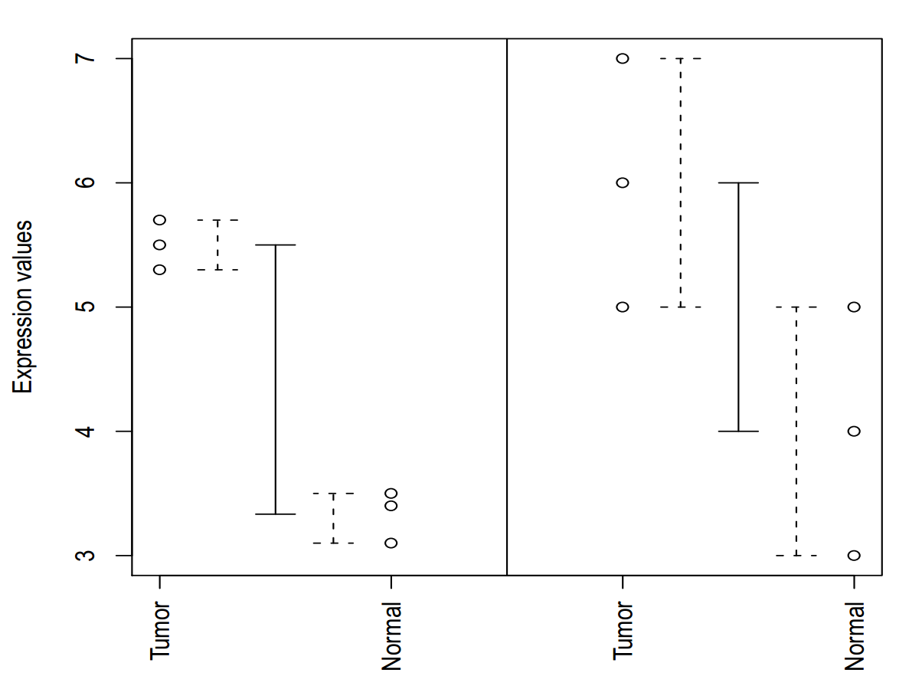

===================================================
Differential expression analysis with limma and SAM
===================================================

.. Day 2, Block 11:00-12:30 
    The theoretical first part (~20-30m) of the talk will be given at the beginning of the block. (CG)
    Followed by practical limma and SAM (MD)

.. http://www.plosone.org/article/info%3Adoi%2F10.1371%2Fjournal.pone.0012336

Differential expression calculation
===================================

- Identifying differentially expressed genes between two conditions or groups of conditions
- Identifying **significant** changes
- **Many** genes, and many more genes than observations (arrays)
- Multiple hypothesis testing

Variability and gene expression
===============================

Variability and gene expression
===============================

T-test: 

.. math::
    :fontsize: 18

    t = \frac{\mu_{1} - \mu_{2}}{s^{2}(n_{1}^{-1} + n_{2}{^{-1}})}

With *pooled* sample variance:

.. math::
    s^{2} = \frac{\sum^{i}(x_{i}-\mu_{1})^{2} + \sum^{j}(x_{j}-\mu_{2})^{2}}{n_{1}+n_{2}-2}

T-test problems
===============

(TODO ILLUSTRATION)

T-test problems
===============

- T-test statistic (and p-value) crucially depends on difference in means and variance, but... 
- Hard to estimate variance with small sample size
- No multiple hypothesis testing 
    - Can be done with, e.g, Bonferroni correction, but with large loss of power

.. - Assumes data is normally distributed

(TODO illustration of how small samples from a normal can lead to small or big variance estimates)

SAM: Significance Analysis of Microarrays (2001)
================================================

(TODO Overview figure)

.. class:: footnote

    Tusher, Tibshirani, and Chu, PNAS, 2001.

SAM: Significance Analysis of Microarrays
=========================================

.. SAM tutorial: www.biostat.pitt.edu/biost2055/11/110202_W5_Lab2.doc
.. Technical documentations: http://www-stat.stanford.edu/~tibs/SAM/sam.pdf
    See especially section 17
.. Nontechnical explanation: http://archive.sciencewatch.com/inter/aut/2008/08-oct/08octSWTibshirani/

How does SAM improve on T-test?

- Penalizes low-expressed (unreliable mean and variance) genes:
    - Adds a constant "exchangeability factor" :math:`s0` to the denominator of its test statistic
    - :math:`s0` is the same for all genes

.

.. math::
    :fontsize: 22

    d_{i} = \frac{\mu_{1} - \mu_{2}}{s_{i} + s_{0}}

- :math:`d_{i}` - Test statistic of gene i: 
- :math:`s_{i}` - Pooled standard deviation of gene i
- **Larger** :math:`|d_{i}|` **means stronger (normalized) differential expression**

SAM: Multiple hypothesis correction
===================================

(FDR correction)

LIMMA - LInear Models for Microarray Analysis
=============================================

BAD ways to calculate DE
========================

- Order by FC or FC cutoff 
    - doesn't take variance into account
- T-test 
    - Estimates gene variance for each gene individually 
        - With small sample sizes, a high probability that variance will be seriously underestimated for some genes
    - Prone to false positives on genes with low variance
    - Low "power"

Modern approaches to DE calculation
===================================

**Homoscedastic** methods assume that each treatment group has the same variance:

- ANOVA, RVM, limma, VarMixt

**Heteroscedastic** methods do not make this assumption (and must estimate the variance for each group):

- Welch t-test, SMVar

**Nonparametric** methods do not assume any particular probability distribution:

- Significance analysis of microarrays (SAM), Wilcoxon rank-sum

Similar assumptions -> similar results
======================================

.. image:: img/de-method-comparison.png
    :scale: 80%

.. class:: footnote

Jeanmougin et al, 2010, PloS One.

.. Useful links:
    Simple limma explanation -http://www.bioconductor.org/help/course-materials/2009/BioC2009/labs/limma/limma.pdf
    Simplified explanation of hierarchical models - http://www.nature.com/nbt/journal/v28/n4/pdf/nbt.1619.pdf
    Explanation of SAM - http://odin.mdacc.tmc.edu/~kim/TeachBioinf/Week5/Lecture5-Feb11-08.pdf
    Original limma paper - http://www.statsci.org/smyth/pubs/ebayes.pdf

