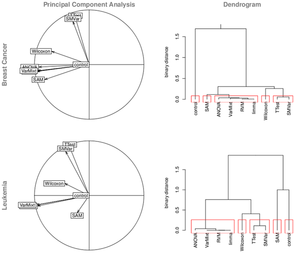

===================================================
Differential expression analysis with limma and SAM
===================================================

.. Day 2, Block 11:00-12:30 
    The theoretical first part (~10m) of the talk will be given at the beginning of the block.
    The practical part may be given immediately after or not.

.. http://www.plosone.org/article/info%3Adoi%2F10.1371%2Fjournal.pone.0012336

BAD ways to calculate DE
========================

- Order by FC or FC cutoff 
    - doesn't take variance into account
- T-test 
    - Prone to false positives on genes with low variance
    - Low "power"

General approaches to DE calculation
====================================

**Homoscedastic** methods assume that each treatment group has the same variance:

- ANOVA, RVM, limma, VarMixt

**Heteroscedastic** methods do not make this assumption (and must estimate the variance for each group):

- Welch t-test, SMVar

**Nonparametric** methods do not assume any particular probability distribution:

- Significance analysis of microarrays (SAM), Wilcoxon rank-sum

Similar assumptions -> similar results
======================================

.. class:: footnote

Jeanmougin et al, 2010, PloS One.

Foobar
======

- Comparison with SAM
- Theoretical introduction
- What is a design and contrast matrix
- Worked example
