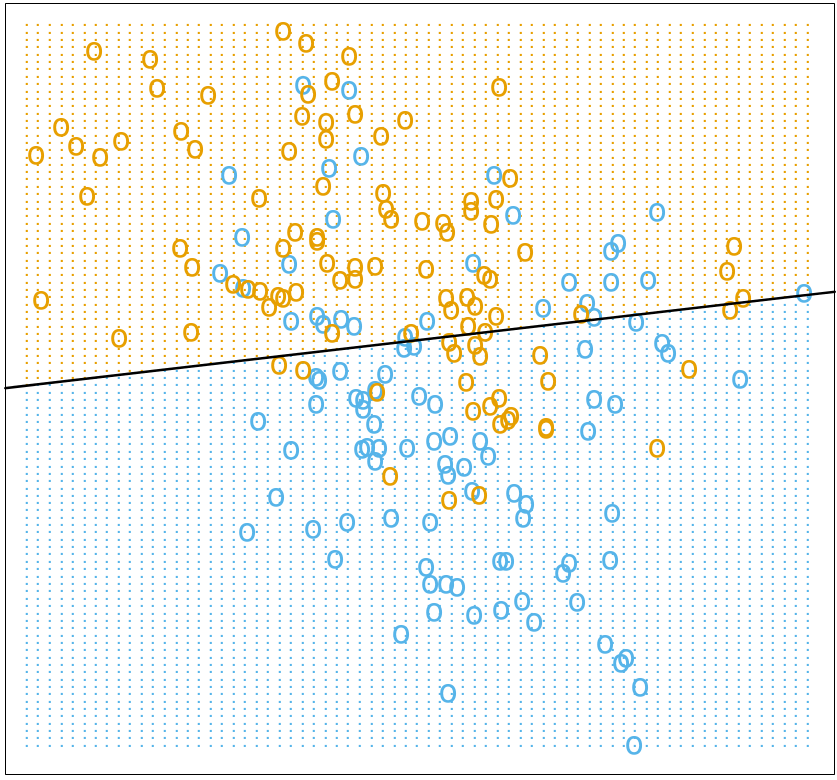
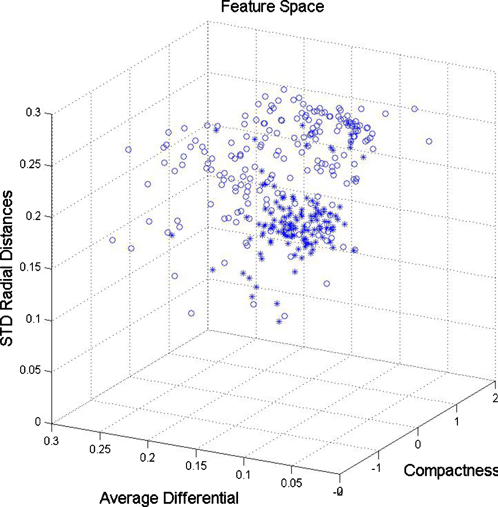

===================
Prediction analysis
===================

.. Day 2, 2:30-3:30p (part 2 of block starting at 1:30p)
    - Linear model theory (CG)
    - Linear model practical (CG)
    - SVM theory (CG)
    - PAMR (MD)

What is prediction analysis?
============================

- Use gene expression and/or other data to predict **categorical** or **continuous** variables.
- For example:
    - Tumor or normal?
    - Cell type? Tumor subtype?
    - Drug response?
    - Blood pressure?
- *Classification* vs *regression*
- Prediction analysis =  *machine learning* applied to biological problems

Feature space
=============

Goal of classification
======================

Classification: Find a "decision boundary" or "hyperplane" that optimally separates categories.

- Linear & logistic regression
- Nearest neighbors
- Support vector machine (SVM)
- Neural networks
- Decision trees

Linear regression
=================

.

.. math::
    :fontsize: 18

    y \sim \beta_{0} + \beta_{1}x_{1} + \beta_{2}x_{2} + ... + \beta_{i}x_{i}

The model consists of :math:`\beta_{0}...\beta_{i}`, which must be learned from the data. 

Two common algorithms:

- Ordinary least squares (OLS) - exact answers, **but** variables must be uncorrelated (not a good assumption for gene expression!)
- Gradient descent (approximate)

Assessing performance
=====================

Bias-variance tradeoff
======================

.. Nice semi-theoretical introduction to kernel methods:
    http://yosinski.com/mlss12/MLSS-2012-Fukumizu-Kernel-Methods-for-Statistical-Learning/
